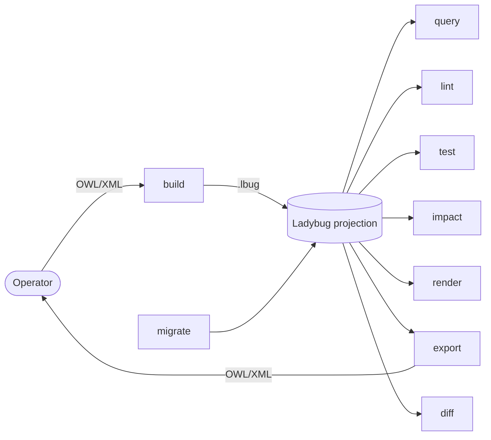
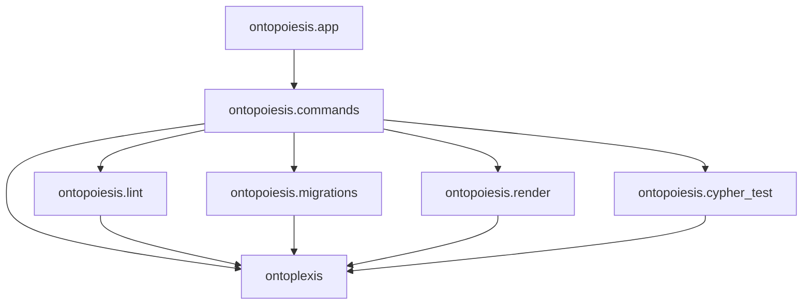

# Code Maps

Ontopoiesis is a projection-oriented operator CLI. It accepts OWL/XML documents to build
Ladybug projections, then runs all operator workflows against the resulting `.lbug` file.
For the projection data model, see [Projection Model](../cypher-model.md). For package
boundaries, see [Package Architecture](package.md).

## Command flow

`build` calls `ontoplexis.Ontology.from_owlxml()` and saves its projection. `export`
opens a projection, reconstructs an `Ontology`, and writes OWL/XML with
`Ontology.to_owlxml()`. Conversion, profile validation, and reasoning are deliberately
external to Ontopoiesis.

## Package layers

## Responsibilities

| Area | Responsibility |
| --- | --- |
| `ontopoiesis.commands` | Parse command options, validate paths, call workflows, and format terminal output. |
| `ontopoiesis.lint` | Register and run Cypher-based structural lint rules. |
| `ontopoiesis.migrations` | Apply Jinja-rendered Cypher migrations and manage migration UIDs. |
| `ontopoiesis.render` | Select graph visibility and produce SVG, PNG, or DOT output. |
| `ontopoiesis.cypher_test` | Adapt Cypher assertions to pytest collection and reporting. |
| `ontoplexis` | OWL/XML parsing and serialization, construct models, projection storage, and graph traversal. |

## Contributor guidance

Keep commands at the operator boundary. Reusable graph traversal, construct-model logic,
display selection, and fingerprinting belong in `ontoplexis`; rendering policy, lint rule
packaging, migrations, and test integration belong in Ontopoiesis.

All document input and output owned by this CLI is OWL/XML. Use an external tool such as
ROBOT or Protege for other serializations, import resolution, or reasoning before building
a projection.
